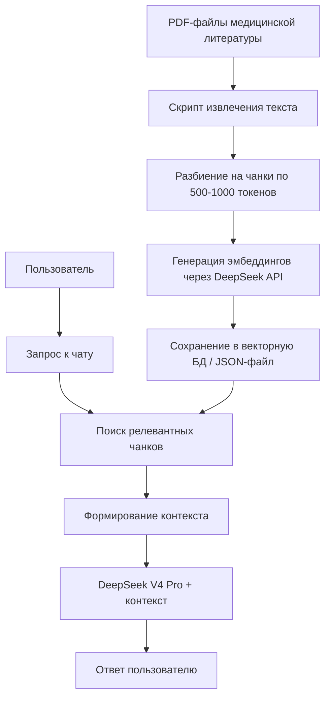

# Архитектура RAG-системы для медицинской литературы

## Общая схема



## Компоненты

### 1. Скрипт извлечения текста из PDF
- **Язык:** Node.js (уже есть в проекте)
- **Библиотека:** `pdf-parse` (лёгкая, без головного мозга)
- **Вход:** путь к папке с PDF-файлами
- **Выход:** JSON-файл с извлечённым текстом

### 2. Разбиение на чанки
- **Стратегия:** рекурсивное разбиение по заголовкам и абзацам
- **Размер чанка:** 500-1000 токенов (перекрытие 100 токенов)
- **Метаданные:** имя файла, номер страницы, заголовок раздела

### 3. Генерация эмбеддингов
- **API:** DeepSeek API (`https://api.deepseek.com/v1/embeddings`)
- **Модель эмбеддингов:** `deepseek-embedding-v2` (или `text-embedding-ada-002` через OpenAI)
- **Альтернатива:** локально через Ollama (`nomic-embed-text`)

### 4. Векторное хранение
- **Вариант А (простой):** JSON-файл с эмбеддингами + косинусное расстояние в памяти
- **Вариант Б (масштабируемый):** ChromaDB (лёгкая, встраиваемая)

### 5. Поиск (query)
- **Метод:** косинусное сходство между эмбеддингом запроса и всеми чанками
- **Top-K:** 3-5 наиболее релевантных чанков
- **Порог:** минимальное сходство 0.5

### 6. Интеграция с чатом
- При каждом запросе пользователя:
  1. Сгенерировать эмбеддинг запроса
  2. Найти Top-K чанков
  3. Добавить их в system prompt как контекст
  4. Отправить запрос DeepSeek V4 Pro

## Структура файлов

```
NEW/
├── medical-chat-deepseek.html   # Чат-интерфейс (уже есть)
├── rag/
│   ├── extract-pdfs.mjs         # Шаг 1: извлечение текста из PDF
│   ├── chunk-text.mjs           # Шаг 2: разбиение на чанки
│   ├── generate-embeddings.mjs  # Шаг 3: генерация эмбеддингов
│   ├── build-index.mjs          # Шаг 4: сборка векторного индекса
│   ├── search.mjs               # Шаг 5: поиск по индексу
│   ├── config.json              # Конфигурация (пути, API-ключ)
│   └── index.json               # Выходной файл: векторный индекс
└── literature/                  # Папка с PDF-файлами (создаётся пользователем)
```

## Формат векторного индекса (`index.json`)

```json
{
  "chunks": [
    {
      "id": 0,
      "text": "Полный текст чанка...",
      "metadata": {
        "source": "filename.pdf",
        "page": 12,
        "heading": "Симптомы острого панкреатита"
      },
      "embedding": [0.001, -0.023, ...]  // массив из 1024+ чисел
    }
  ],
  "model": "deepseek-embedding-v2",
  "chunk_size": 800,
  "overlap": 100
}
```

## План реализации

| Шаг | Файл | Описание | Зависимости |
|---|---|---|---|
| 1 | `rag/extract-pdfs.mjs` | Читает все PDF из `literature/`, извлекает текст | `pdf-parse` |
| 2 | `rag/chunk-text.mjs` | Разбивает текст на чанки с метаданными | — |
| 3 | `rag/generate-embeddings.mjs` | Отправляет чанки в DeepSeek API, получает эмбеддинги | API-ключ |
| 4 | `rag/build-index.mjs` | Собирает `index.json` | Шаги 1-3 |
| 5 | `rag/search.mjs` | Поиск Top-K чанков по запросу | `index.json` |
| 6 | Интеграция в `medical-chat-deepseek.html` | Добавить RAG-контекст перед отправкой в LLM | Шаг 5 |

## Зависимости (npm)

```json
{
  "dependencies": {
    "pdf-parse": "^1.1.1"
  }
}
```

## Примечания

- DeepSeek API поддерживает эмбеддинги через `https://api.deepseek.com/v1/embeddings`
- Если DeepSeek не поддерживает эмбеддинги — используем OpenAI `text-embedding-3-small` или локальный Ollama `nomic-embed-text`
- Для больших объёмов литературы (100+ PDF) рекомендуется ChromaDB вместо JSON
